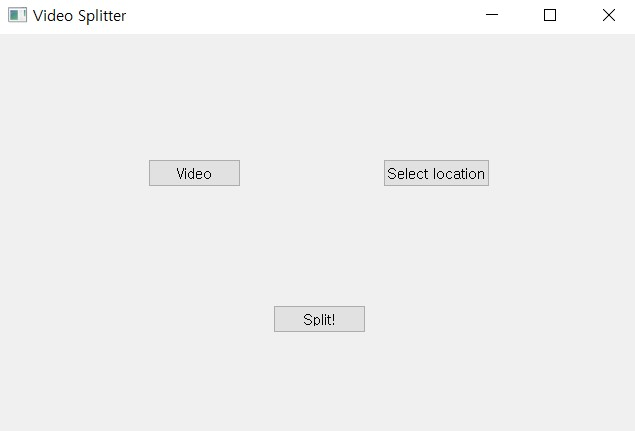

# Video Splitter (비디오 스플리터) 

### 동영상의 모든 프레임을 이미지 파일로 저장합니다.  

## 1. 사용 방법
 
</img>

 

- 먼저, Video 버튼을 눌러 프레임을 추출하고 싶은 동영상(*.mp4)을 선택합니다.

- 그 다음, Select location 버튼을 눌러 저장할 위치를 선택합니다.
  
- 마지막으로, Split! 버튼을 눌러 여러장의 프레임 이미지가 담긴 파일을 저장합니다.

 

## 2. 설치 방법
- 먼저, git과 Anaconda가 설치되어 있어야 합니다.
- 비어있는 디렉토리에 다음 명령어를 통해 가상환경을 만듭니다.

      conda create -n myenv python=3.9
- 그 다음, 가상환경을 실행시켜줍니다.

      conda activate myenv
- 이제, 이 파일을 내려 받습니다.

      git clone https://github.com/JiunJung/videoSplitter.git
- 다음 명령어를 통해서 필요한 라이브러리를 설치합니다.

      pip install -r requirements.txt
- 이제 모든 준비가 끝났습니다. 다음 명령어를 통해서 실행하십시오.
  
      python main.py

